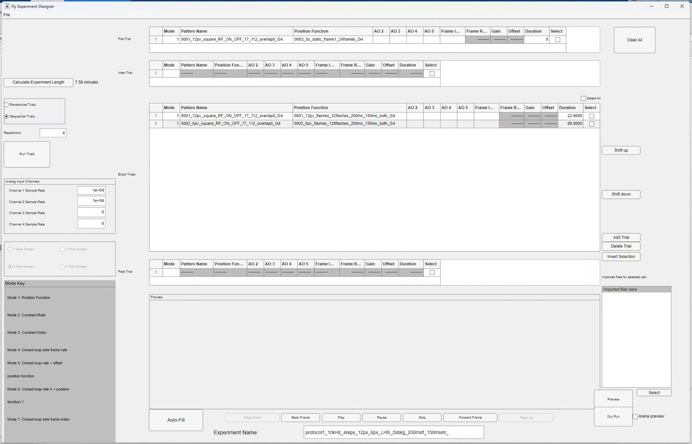
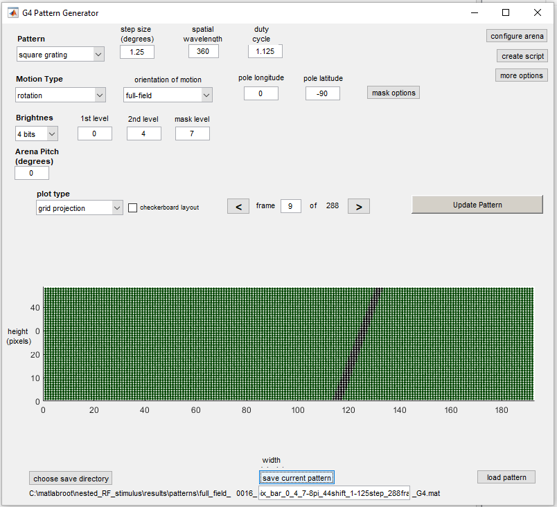
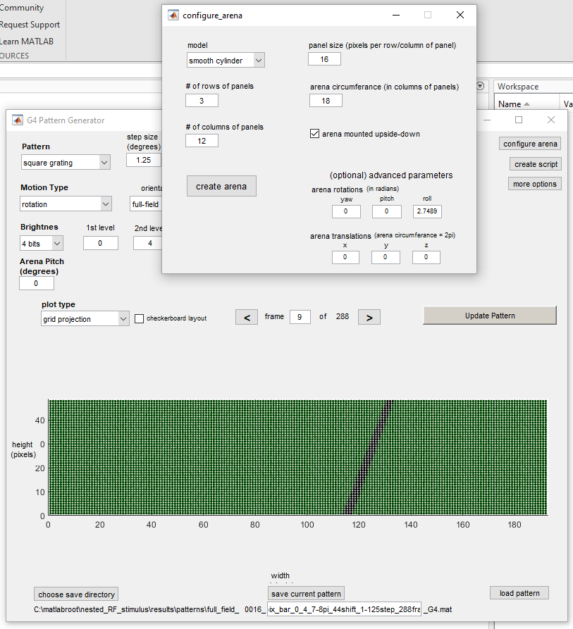
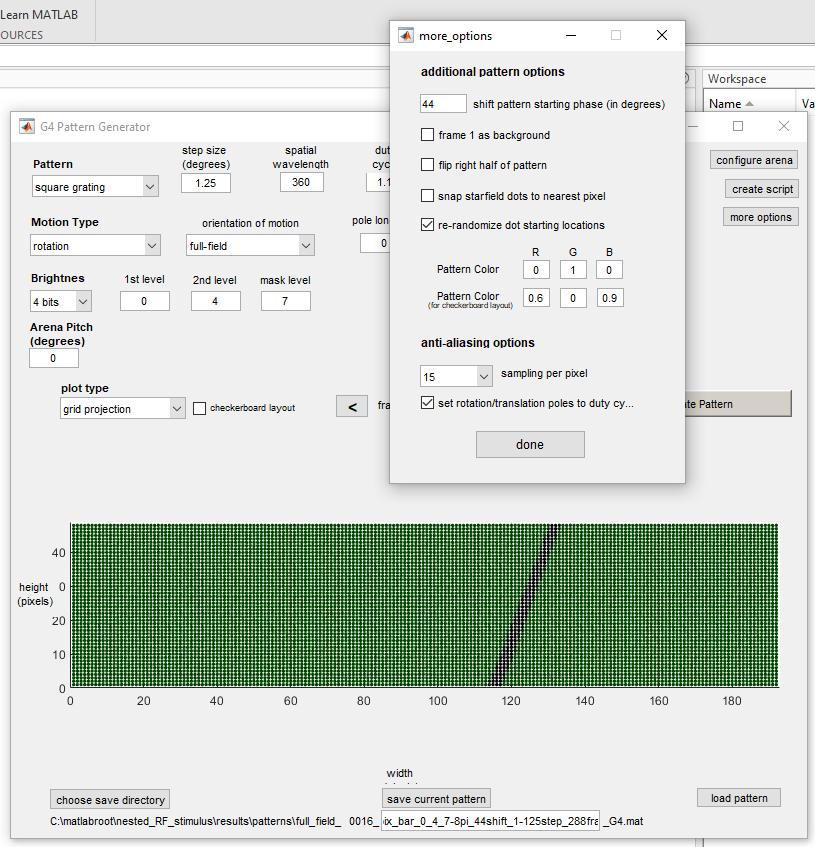

P1 protocols are located within the repository within the [`protocols`](https://github.com/reiserlab/tutl-T4/tree/main/protocols) folder. 

However, a user may wish to make a new modified version of P1, so I will outline the steps to create a version of P1 from scratch below.

## Making P1 from scratch

::: {.callout-note}
### Key points
- The patterns and position functions for P1 are generated programmatically by the function `generate_protocol1_stimuli.m`. This function should be run first to create the necessary pattern and position function files.
- The protocol is then assembled in the `G4_experiment_designer` GUI using the generated patterns and position functions.
- A copy of the `processing_settings.mat` file must be made and saved within the new protocol folder, and the settings within this file must be updated to point to the new protocol and to have the correct settings for a P1 protocol.
:::

### Make new patterns and position functions

If a user wishes to make a new version of P1, they will likely want to change some of the parameters of the stimuli, such as the size of the flash stimuli, the duration of the flashes and/or intervals, or the pixel intensity values. To do this, you need to run the function [`generate_protocol1_stimuli.m`](https://github.com/reiserlab/tutl-T4/blob/main/src/stimulus_generation/generate_protocol1_stimuli.m) and modify the relevant parameters within this function before running it.

**Display settings:** The range of pixels within which to present the stimuli is defined within this function by `disp_x1`, `disp_x2`, `disp_y1` and `disp_y2`. For the LHS version of the protocol, the pixel limits start with `disp_x1` = 17. This is because we skip the leftmost column (from the fly's perspective, right most column when looking at the panels from the front). The LED arena is also 3 rows high, so the y range is from 1 to 48, since there are 16 pixels per panel.

**Stimulus parameters:**

A number of metrics are assigned to a structure called `params` which is the input to the function `generate_stimulus` to create the patterns and position functions.

- `px_intensity` - The pixel intensity values to be used for the stimuli. This parameter should be a [1 x 3] array corresponding to [bkg_color, off_color, on_color] and should be three integer values between 0 and 15. 0 means the LED is off and 15 is the maximum intensity.
- `flash_sz` - The size of the flash (`flash_sz` x `flash_sz`) in pixels.
- `root_dir` - Directory to create the `patterns` and `functions` folders for saving the files.
- `px_rng = [disp_y1, disp_y2, disp_x1, disp_x2]` - Pixel range of screen within which to present the flashes - [row_start, row_end, col_start, col_end]
- `overlap` - Percentage of overlap of the grid within which the flashes are presented. If 0, then there is no overlap between flash positions.
- `bkg_frame` - The background frame = frame 1 in the pattern.
- `interval_dur` - The duration of interval background screen between flashes (seconds).
- `flash_dur` - The duration of each flash stimulus (seconds).
- `on_off` - Whether to present bright 'on', dark 'off' or both 'both' flashes. For P1 this should be set to 'both'.

This `params` structure is then fed into the function `generate_stimulus` which then creates the patterns and postion functions required for P1.

The <b>static position function</b> is also made within `src/stimulus_generation/generate_protocol1_stimuli.m`. There is an additional parameter that can be modified: `t_bkg_s`, which is the duration for which the background frame is shown at the beginning of each repetition. This duration is in seconds. This position function will be saved within the same `Functions` folder as the other position functions that are generated within `generate_stimulus`.

### Creating the protocol in the `G4_experiment_designer`

After running `src/stimulus_generation/generate_protocol1_stimuli.m` you should now have two pattern files within `protocols/LHS/patterns` etc. and three position functions within `protocols/LHS/functions` etc. You are now ready to assemble these components into a protocol.\

To do this:

- Run the code: `G4_experiment_designer` in the MATLAB Command Window and the GUI window will appear.
- Load the patterns and position functions into the experiment designer
- Navigate to the folder where you saved the patterns and position functions that you just made using `File`-`Import`-`Folder`.

::: {.callout-note}
All patterns and position functions that are saved in this folder will be imported into the GUI.
You will have to do this twice, once for the patterns and once for the position functions.
:::

- Set the `Pre-trial` stimulus with pattern <b>0001</b> and the static position function (<b>0003</b>).
- Set `Trial 1` as pattern <b>0001</b> and position function <b>0001</b>.
- Set `Trial 2` as pattern <b>0002</b> and position function <b>0002</b>.
- Set `Repetitions` to <b>4</b>.
- Set the `Sample rate` for the first two channels (voltage and frame position) as <b>10,000</b> Hz.

{.ifr_center}

- Set the name of the protocol to something logical. For instance, one of the protocols within the repository is named: `protocol1_4reps_12px_6px_LHS_2sbkg_200msfl_50msint`.
- Save the protocol.

You should see that a folder has been made within the `protocols` folder with the name of the protocol, and within that folder there should be a `.g4p` file with the same name as the folder.

### Updating the processing settings

- Make a copy of the file `protocols/processing_settings.mat` and paste it within the newly created experiment folder `protocols/LHS/protocol1_...`.

The following variables should be set for a P1 protocol:

- `path_to_protocol` - must be set to  the path to the protocol, including the full name of the `.g4p` file (with the extension).
- `is_ephys_grid = 1;`
- `neutral_frame = 1;`
- `grid_columns = [8, 16];`
- `grid_rows = [4, 8];`

::: {.callout-note}
If a variation of P1 is made that only uses one pixel size, then the values for `grid_columns` and `grid_rows` will be integers and not tuples.
:::

This new protocol is now ready to be run using the `G4_experiment_conductor`.\

As long as the parameter `is_ephys_grid` is set to 1 in the settings file, the data should be processed appropriately and the necessary plots for identifying the `peak_frame` should be generated.

______________________________________________________________________

## Making P2 from scratch.

Protocol 2 is made from scratch every time that you run the function `generate_protocol2`, so is more easy to modify than P1. 

::: {.callout-important}
## Modifications to bar sweep or flash stimuli
Unlike the square flash stimuli, the cropped bar stimuli that are presented in P2 require <b>premade</b> patterns of the <b>full field bar stimuli</b>. These premade patterns are found within the folder `\results\patterns\protocol2\full_field_bars` and new versions of these full field patterns will need to be made if any modifications to the spatial statistics of the bar patterns are desired. The process for making these full field bar patterns is outlined below.
:::
______________________________________________________________________________________________

### Pre-making the full field bar stimuli for P2

The  full field bar stimuli were made using the `G4_pattern_generator_gui`.\

A single vertical bar stimulus was made, 4 pixels width, then the "rotation" of the arena was updated to get the patterns in the 8 different orientations (1/8 pi).\

These patterns were saved in `\results\patterns\protocol2\full_field_bars` for 6/15 background intensity and `\results\patterns\protocol2\full_field_bars4` for 4/15 background intensity (from July 2025 onwards).

| Pattern parameters | Value |
|:------|:-------|
| Pattern | Square grating| 
| Step size (deg)| 1.25 |
| Spatial wavelength| 360 |
| Duty cycle| 1.125 |
| Motion Type| Rotation |
| Orientation of motion| full-field |
| Pole longitude| 0 |
| Pole latitude| -90 |
| Brightness| 4 bits |
| 1st level| 0 |
| 2nd level| 4 |
: {.bordered}

 

{.ifr_center}
 
**Configure Arena:**

| Pattern parameters | Value |
|:------|:-------|
| Arena rotation (roll) | 2.7489 radians for (7/8*pi)| 
: {.bordered}

 

{.ifr_center}

**More options:**

| Pattern parameters | Value |
|:------|:--|
| Shift pattern in starting phase | 44| 
: {.bordered}

 

{.ifr_center}

______________________________________________________________________________________________

### How the cropped bar patterns are generated

During `generate_protocol2`, the function `generate_bar_patterns_xy` crops the premade full field bar patterns to create the localised bar stimuli for P2. The cropping process works as follows:

1. Each full field bar pattern contains **288 frames**, corresponding to the bar at 288 different positions across the full arena width.
2. The arena centre is at pixel coordinates **[24, 96]** (height, width). A region of size `px_crop` x `px_crop` is extracted around this centre point.
3. This cropped bar region is then placed into the final pattern at the location centred on the `peak_frame` position from Protocol 1.
4. The cropped patterns are saved within the experiment folder. The position function then determines which of these 288 frames are shown at each time point during the stimulus presentation.

For `px_crop = 30` (current protocol), the extracted region spans:

| Dimension | Centre | Half-width | Extracted range |
|:----------|:-------|:-----------|:----------------|
| Height | 24 | 14 | rows 10–38 |
| Width | 96 | 14 | columns 82–110 |
: {.bordered}

______________________________________________________________________________________________

### How the position functions are generated

#### Bar sweep position functions

The position functions for bar sweeps are generated by `generate_bar_pos_fns`. This script generates position functions programmatically (not using the GUI, though you can view them in the GUI afterwards).

Each bar sweep position function has two sections:

1. **Static section** (1s) — holds frame 1 (background) to provide a baseline period before the bar appears.
2. **Sawtooth section** — ramps from `fr_low` to `fr_high` at a frequency determined by the sweep speed. Setting `flip = 1` reverses the ramp direction (`fr_high` → `fr_low`), producing motion in the opposite direction.

The same position function can be used for different bar orientations. Separate position functions are created for each combination of speed and direction (forward/flip).

For `px_crop = 30`, the frame range and sweep durations are:

| Speed | Frame range | Sweep duration | Total per direction |
|:------|:------------|:---------------|:--------------------|
| 28 dps | 11–62 | 2.33s | 3.33s (1s static + 2.33s sweep) |
| 56 dps | 11–62 | 1.18s | 2.18s |
| 168 dps | 11–62 | 0.40s | 1.40s |
: {.bordered}

#### Static (grey background) position functions

The static position functions are generated by `generate_static_function`, called within `create_protocol2`. These hold frame 1 (the background frame) for a fixed duration. Two static functions are created:

- **10s static** — used at the start of the protocol, between each repetition, and at the end.
- **3s static** — used between stimulus blocks within each repetition.

______________________________________________________________________________________________

### How the bar flash stimuli are generated

The bar flash stimuli are generated by two functions that are **not documented elsewhere** in the codebase:

#### Bar flash patterns — `generate_bar_flash_stimulus_xy`

This function creates the bar flash patterns by extracting specific frames from the premade full field bar patterns. For each of the 8 bar orientations, 11 frames are selected around a central frame position with a step size of 2 pixels between positions. This produces a pattern with **88 frames total** (8 orientations x 11 positions).

The contrast (ON or OFF) determines which set of full field bar patterns to use: patterns 1–8 for ON bars, patterns 9–16 for OFF bars.

#### Bar flash position functions — `generate_bar_flash_pos_fns`

This function creates randomised position functions for the bar flash stimuli. Two speed conditions are generated:

| Speed | Flash duration | Interval | Total per flash |
|:------|:---------------|:---------|:----------------|
| Slow | 80ms | 920ms | 1000ms |
| Fast | 14ms | 486ms | 500ms |
: {.bordered}

For each speed, the function generates a separate random presentation order for each repetition. The position function alternates between interval (background) and flash (bar frame) periods for all 88 bar flash positions.

______________________________________________________________________________________________

### Stimulus parameters of P2

The following tables list all configurable parameters in `generate_protocol2.m`. Parameters are grouped by stimulus type.

#### General parameters

| Parameter | Current value | Description |
|:----------|:-------------|:------------|
| `px_intensity` | `[4, 0, 15]` | Pixel intensity as [background, OFF, ON]. Integer values 0–15 |
| `px_crop_flash` | 30 | Side length (px) of the square flash stimulus area |
| `px_crop_bar` | 30 | Side length (px) of the bar stimulus area |
| `n_reps` | 3 | Number of repetitions for bar flash randomisation |
| `screen_width_start` | 17 | First column of the displayable arena area |
| `screen_width_end` | 192 | Last column of the arena |
| `screen_height_start` | 1 | First row of the arena |
| `screen_height_end` | 48 | Last row of the arena |
: {.bordered}

#### Square flash parameters

| Parameter | Current value | Description |
|:----------|:-------------|:------------|
| `px_flash` | 4 | Side length (px) of the square flash stimulus |
| `flash_dur_slow` | 0.16 | Flash duration in seconds (160ms) |
| `int_dur_slow` | 0.44 | Inter-flash interval in seconds (440ms) |
: {.bordered}

::: {.callout-note}
For 6px flashes, `px_crop_flash` is increased to 33 to fit an even number of flashes on a 50% overlapping grid within the stimulus area. The 6px flash generation reuses the same duration and interval parameters.
:::

#### Bar sweep parameters

| Parameter | Current value | Description |
|:----------|:-------------|:------------|
| `dps` | `[28, 56, 168]` | Bar sweep speeds in degrees per second |
: {.bordered}

Bar sweep speeds are defined within `generate_bar_pos_fns`. To add or remove speeds, modify both `generate_protocol2.m` (which calls the generation functions) and `generate_bar_pos_fns.m` (which defines the speed-dependent durations and frame ranges).

#### Bar flash parameters

| Parameter | Current value | Description |
|:----------|:-------------|:------------|
| `n_flank` | 5 | Number of bar positions on each side of centre (total positions = 2 x `n_flank` + 1 = 11) |
: {.bordered}

The bar flash durations and intervals (80ms/920ms slow, 14ms/486ms fast) are defined within `generate_bar_flash_pos_fns`. To modify these, edit that function directly.
